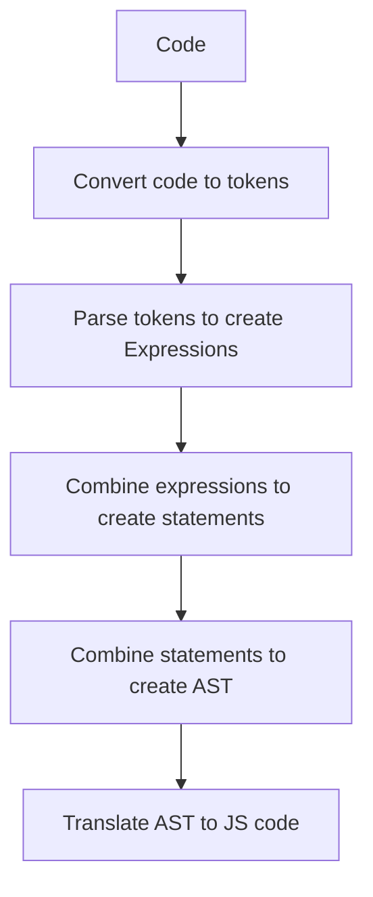

<p align="center">
  <a href="https://rudderstack.com/">
    
  </a>
</p>

<p align="center"><b>The Customer Data Platform for Developers</b></p>

<p align="center">
  <b>
    <a href="https://rudderstack.com">Website</a>
    ·
    <a href="https://github.com/rudderlabs/rudder-json-template-engine/blob/main/docs/syntax.md">Documentation</a>
    ·
    <a href="https://rudderstack.com/join-rudderstack-slack-community">Community Slack</a>
  </b>
</p>

---

# JSON Template Engine

## Overview

Welcome to our JSON Template Engine! This powerful tool simplifies transforming JSON data from one format to another, making it easier to manage and maintain complex integrations.

### Why JSON Template Engine?

As an integration platform supporting over 200 integrations, we understand the challenges of maintaining and optimizing these connections. Traditionally, we used native JavaScript code for data transformation, which required significant effort and maintenance. While JSONata offered a more efficient way to manipulate JSON data, we still encountered performance bottlenecks due to its parsing and interpretation overhead.

### Our Solution

To address these challenges, we've developed our own JSON Transformation Engine. This engine generates optimized JavaScript code from transformation templates, reducing runtime overhead and significantly improving performance.

## Key Features

- **Efficiency**: Our engine generates JavaScript code that minimizes parsing and interpretation overhead, ensuring faster execution.

- **Extensibility**: Easily add new transformation templates to meet your specific integration needs.

- **Simplicity**: Write concise transformation templates that are easy to understand and maintain.

## Implementation

This library generates a javascript function code from the template and then uses the function to evaluate the JSON data. It outputs the javascript code in the following stages:

1. [Lexing](src/lexer.ts) (Tokenization)
1. [Parsing](src/parser.ts) (AST Creation)
1. [Translation](src/translator.ts) (Code generation)



[Engine](src/engine.ts) class abstracts the above steps and provides a convenient way to use the json templates to evaluate the inputs.

## Getting started

### Use npm package

`npm install @rudderstack/json-template-engine`

```ts
const { JsonTemplateEngine } = require('@rudderstack/json-template-engine');
const engine = JsonTemplateEngine.create(`'Hello ' + .name`);
engine.evaluate({ name: 'World' }); // => 'Hello World'
```

### Use CDN URL directly in the browser
Latest URL: https://cdn.jsdelivr.net/npm/@rudderstack/json-template-engine/build/json-template.min.js
<!-- x-release-please-start-version -->
Versioned URL: https://cdn.jsdelivr.net/npm/@rudderstack/json-template-engine@0.12.4/build/json-template.min.js 

```html
<script type="module">
      import { JsonTemplateEngine } from 'https://cdn.jsdelivr.net/npm/@rudderstack/json-template-engine@0.12.4/build/json-template.min.js';
      const engine = JsonTemplateEngine.createAsSync(`'Hello ' + .name`);
      engine.evaluate({ name: 'World' });
</script>
```
<!-- x-release-please-end -->

Refer this [example](/index.html) for more details.

[Demo](https://rudderlabs.github.io/rudder-json-template-engine/)

## Features

Template is a set of statements and result the last statement is the output of the template.

### Variables

```js
const a = 1;
let b = a + 2;
a + b;
```

Refer this [example](test/scenarios/assignments/template.jt) for more details.

### Basic Expressions

#### Conditions

```js
a > b ? a : c;
```

Refer this [example](test/scenarios/conditions/template.jt) for more details.

#### Comparisons

```js
a === b || c > d;
```

Refer this [example](test/scenarios/comparisons/template.jt) for more details.

#### Math Operations

```js
10 - 2 + 2 * 10;
```

Refer this [example](test/scenarios/math/template.jt) for more details.

#### Logical operations

```js
false || true;
```

Refer this [example](test/scenarios/logics/template.jt) for more details.

### Input and Bindings

Input refers to the JSON document we would like to process using a template. Bindings refer to additional data or functions we would provide to process the data efficiently.

Example:

- Template: `"Hello " + (.name ?? $.defaultName)`
- Evaluation: `engine.evaluate({name: 'World'}, {defaultName: 'World'});`
- `{name: 'World'}` is input.
  - `^.name` refers to "name" property of the input. We can also use `.name` to refer the same. `^` always refers to the root of the input and `.` refers to current context. Refer this [example](test/scenarios/selectors/context_variables.jt) for more details.
- `{defaultName: 'World'}` is bindings.
  - `$.defaultName` refers to "defaultName" property of the bindings. Refer this [example](test/scenarios/bindings/template.jt) for more details.

### Arrays

```js
let arr = [1, 2, 3, 4]
let a = arr[1, 2] // [2, 3]
let b = arr[0:2] // [1, 2]
let c = arr[-2:] // [3, 4]
```

Refer this [example](test/scenarios/arrays/template.jt) for more details.

### Objects

```js
let key = "some key"
// { "a": 1, "b": 2, "c": 3, "some key": 4 }
let obj = {a: 1, b: 2, c: 3, [key]: 4 }
let a = obj["a"] // 1
let b = obj.a // 1
let c = obj{["a", "b"]} // { "a": 1, "b": 2}
let d = obj{~["a", "b"]} // { "c": 3, "some key": 4}
```

Refer this [example](test/scenarios/objects/template.jt) for more details.

#### Object Context Props
```js
let obj = {a: 1, b: 2, c: 3 };
obj.({
  @e [e.key]: e.value * e.value, // @e refers to each key, value pairs,
  d: 16 // we can have other props also
})  // { a: 1, b: 4, c: 9, d: 16}
```
Refer this [example](test/scenarios/objects/context_props.jt) for more details.

### Functions

#### Normal functions

```js
let fn = function (arg1, arg2) {
  arg1 + arg2;
};
```

The result of the last statement of function will be returned as result of the function. We can also use rest params (`...args`).

#### Lambda/Short functions

```js
let fn = array.map(lambda 2 * ?0);
```

This function gets converted to:

```js
let fn = array.map(function (args) {
  2 * args[0];
});
```

Lambda functions are short to express the intention and it is convenient sometimes.

#### Async functions

```js
let fn = async function (arg1, arg2) {
  const result = await doSomethingAsync(arg1, arg2);
  doSomethingSync(result);
};
```

**Note:** When we want to use async functions then we need to create template engine using `JsonTemplateEngine.create`. If you create a template this way then it will be created as an async function so we can `await` anywhere in the template.

```js
let result = await doSomething(.a, .b)
```

Refer this [example](test/scenarios/functions/template.jt) for more details.

### Paths

Paths are used to access properties in `input`, `bindings` and `variables`.

#### Simple Paths

Simple paths support limited path features and get translated as direct property access statements in the generate javascript code.
`a.b.c` gets translated to `a?.b?.c` so they are very fast compared to [Rich paths](#rich-paths). Simple paths are ideal when we know the object structure.

**Supported features:**

- [Simple Selectors](#simple-selectors)
- [Single Index Filters](#single-index-or-property-filters)
  Refer this [example](test/scenarios/paths/simple_path.jt) for more details.

#### Rich Paths

Rich paths gets converted complex code to support different variations in the data.

If we use this rich path`~r a.b.c` then it automatically handles following variations.

- `[{"a": { "b": [{"c": 2}]}}]`
- `{"a": { "b": [{"c": 2}]}}`
- `{"a": [{ "b": [{"c": 2}]}]}`
  Refer this [example](test/scenarios/paths/rich_path.jt) for more details.

#### Json Paths
We support some features of [JSON Path](https://goessner.net/articles/JsonPath/index.html#) syntax using path option (`~j`).
Note: This is an experimental feature and may not support all the features of JSON Paths. 

Refer this [example](test/scenarios/paths/json_path.jt) for more details.

#### Simple selectors

```js
let x = a.b.c;
let y = a."some key".c
```

Refer this [example](test/scenarios/selectors/template.jt) for more details.

#### Wildcard selectors

```js
a.*.c // selects c from any direct property of a
```

Refer this [example](test/scenarios/selectors/wild_cards.jt) for more details.

#### Descendent selectors

```js
// selects c from any child property of a
// a.b.c, a.b1.b2.c or a.b1.b2.b3.c
let x = a..c;
let y = a.."some key";
```

Refer this [example](test/scenarios/selectors/template.jt) for more details.

#### Single Index or Property Filters

```js
let x = a[0].c;
let y = a[-1].c; // selects last element from array
let z = a['some key'].c;
```

Refer this [example](test/scenarios/filters/array_filters.jt) for more details.

#### Multi Indexes or Properties Filters

```js
let x = a[(0, 2, 5)].c;
let y = a[('some key1', 'some key2')].c;
```

Refer this [example](test/scenarios/filters/array_filters.jt) for more details.

#### Range filters

```js
let x = a[2:5].c;
let y = a[:-2].c;
let z = a[2:].c;
```

#### Object Property Filters

```js
let x = obj{["a", "b"]};  // selects a and b
let y = obj{~["a", "b"]}; // selects all properties except a and b
```

Refer this [example](test/scenarios/filters/object_indexes.jt) for more details.

#### Conditional or Object Filters

```js
let x = obj{.a > 1};
```

Refer this [example](test/scenarios/filters/object_filters.jt) for more details.

#### Block expressions

```js
let x = obj.({
  a: .a + 1,
  b: .b + 2
});
let x = obj.([.a+1, .b+2]);
```

Refer this [example](test/scenarios/paths/block.jt) for more details.

#### Context Variables

```js
.orders@order#idx.products.({
    name: .name,
    price: .price,
    orderNum: idx,
    orderId: order.id
})
```

Use context variables: `@order` and `#idx`, we can combine properties of orders and products together. Refer this [example](test/scenarios/context_variables/template.jt) for more details.

#### Path Options

We can mention defaultPathType while creating engine instance.

```js
// For using simple path as default path type
// a.b.c will be treated as simple path
JsonTemplateEngine.create(`a.b.c`, { defaultPathType: PathType.SIMPLE });
// For using rich path as default path type
// a.b.c will be treated as rich path
JsonTemplateEngine.create(`a.b.c`, { defaultPathType: PathType.RICH });
```

We can override the default path option using tags.

```js
// Use ~s to treat a.b.c as simple path
~s a.b.c
// Use ~r to treat a.b.c as rich path
~r a.b.c
// Use ~j for using json paths
~j items[?(@.a>1)]
```

**Note:** Rich paths are slower compare to the simple paths.
Refer this [example](test/scenarios/paths/options.jt) for more details.

### Compile time expressions

Compile time expressions are evaluated during compilation phase using compileTimeBindings option.

```js
// {{$.a.b.c}} gets translated to 1 and
// final translated code will be "let a = 1;"
JsonTemplateEngine.create(`let a = {{$.a.b.c}};`, {
  compileTimeBindings: {
    a: {
      b: {
        c: 1,
      },
    },
  },
});
```

We can use compile time expressions to generate a template and then recompile it as expression. Refer these examples [simple compilation](test/scenarios/compile_time_expressions/template.jt) and [complex compilation](test/scenarios/compile_time_expressions/two_level_path_processing.jt) for more details.

### Mappings
If you are familiar with [JSON Paths](https://goessner.net/articles/JsonPath/index.html#), you can easily begin working with JSON templates by leveraging your existing knowledge through the mappings feature.

**Example:**
* Let's say we want to tranform the following data.
* Input:
```json
{
  "a": {
    "foo": 1,
    "bar": 2
  },
  "b": [
    {
      "firstName": "foo",
      "lastName": "bar"
    },
    {
      "firstName": "fizz",
      "lastName": "buzz"
    }
  ]
}
```
* Output:
```json
{
  "foo": 1,
  "bar": 2,
  "items":[
    {
      "name": "foo bar"
    },
    {
      "name": "fizz buzz" 
    }
  ] 
}
```
* Mappings:
```json
[
  {
    "description": "Copies properties of a to root level in the output",
    "input": "$.a",
    "output": "$",
  },
  {
    "description": "Combines first and last name in the output",
    "input": "$.b[*].(@.firstName + ' ' + @.lastName)",
    "output": "$.items[*].name"
  }
]
```
For more examples, refer [Mappings](test/scenarios/mappings/)

### Comments

Supports both c style single line (`//`) and block comments (`/* .. */`).
Refer this [example](test/scenarios/comments/template.jt) for more details.

For more examples, refer [Scenarios](test/scenarios)

## Testing

`npm test`

## Contribute

We would love to see you contribute to RudderStack. Get more information on how to contribute [**here**](CONTRIBUTING.md).

## License

The RudderStack `rudder-json-template-engine` is released under the [**MIT License**](https://opensource.org/licenses/MIT).
