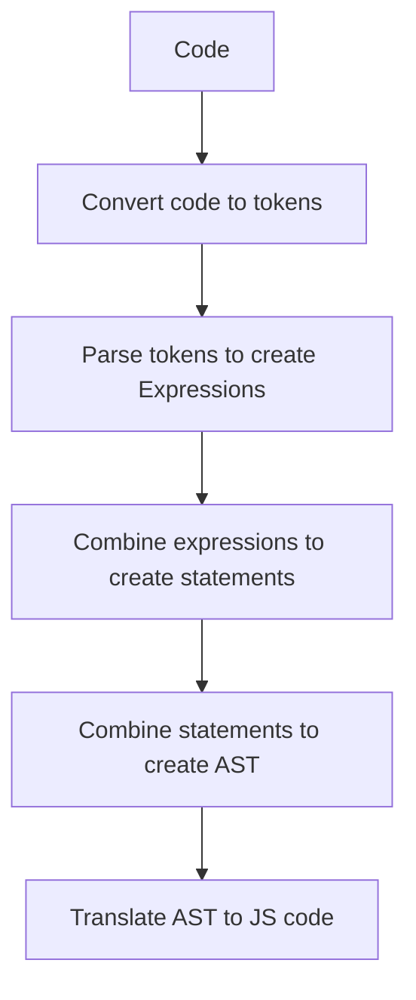

<p align="center">
  <a href="https://rudderstack.com/">
    
  </a>
</p>

<p align="center"><b>The Customer Data Platform for Developers</b></p>

<p align="center">
  <b>
    <a href="https://rudderstack.com">Website</a>
    ·
    <a href="https://github.com/rudderlabs/rudder-json-template-engine/blob/main/docs/syntax.md">Documentation</a>
    ·
    <a href="https://rudderstack.com/join-rudderstack-slack-community">Community Slack</a>
  </b>
</p>

---

# rudder-json-template-engine
## Motivation
We are an integration platform and support 200+ integrations. We implemented these integrations using native Javascript code to transform incoming events to destination payload, so in summary, it is JSON data manipulation. Maintaining all these integrations is challenging, so we explored [jsonata](https://github.com/jsonata-js/jsonata) to write less code to transform JSON data. While this library is excellent, we still need to meet our performance needs. For example, JSONata parses the given template, creates an Abstract Syntax Tree (AST), and interprets the AST for the given input. Since we need to traverse the AST every time, it is slow, so we wanted to build a template engine that generates Javascript code so there will be less overhead during the runtime.

## Overview
A library to process JSON data using a custom syntax based on javascript and [jspath](https://github.com/dfilatov/jspath). We thank the jspath authors for their excellent work, as our library is an extension of the original library. We also want to thank [IBM](https://www.ibm.com/) team for their work on [jsonata](https://github.com/jsonata-js/jsonata), as we have taken several ideas from the library. You can also consider our library as an alternative to [jsonata](https://github.com/jsonata-js/jsonata).

This library generates a javascript function code from the template and then uses the function to evaluate the JSON data. It outputs the javascript code in the following stages:
1. [Lexing](src/lexer.ts) (Tokenization)
1. [Parsing](src/parser.ts) (AST Creation)
1. [Translation](src/translator.ts) (Code generation)



[Engine](src/engine.ts) class abstracts the above steps and provides a convenient way to use the json templates to evaluate the inputs.

## Features
1. [Variables](test/scenarios/assignments/template.jt)
1. [Arrays](test/scenarios//arrays/template.jt)
1. [Objects](test/scenarios/objects/template.jt)
1. [Functions](test/scenarios/functions/template.jt)
1. [Bindings](test/scenarios/bindings/template.jt)
1. [Comments](test/scenarios/comments/template.jt)
1. [Paths](test/scenarios/paths/template.jt)
    * [Filters](test/scenarios/filters)
    * [Selectors](test/scenarios/selectors/template.jt)
    * [Context variables](test/scenarios/context_variables/template.jt)
    * [Simple paths](test/scenarios/paths/simple_path.jt)
    * [Rich paths](test/scenarios/paths/rich_path.jt)
    * [Paths options](test/scenarios/paths/options.jt)
1. [Conditions](test/scenarios/conditions/template.jt)
    * [Comparisons](test/scenarios/comparisons/template.jt)
1. [Math operations](test/scenarios/math/template.jt)
1. [Logical operations](test/scenarios/logics/template.jt)
1. [Compile time expressions](test/scenarios/compile_time_expressions/template.jt)

For more examples, refer [Scenarios](test/scenarios)

## [Syntax](docs/syntax.md)

## Getting started
`npm install rudder-json-template-engine`

```ts
const engine = new JsonTemplateEngine(`'Hello ' + .name`);
engine.evaluate({name: 'World'});
```

## Testing
`npm test`

## Contribute

We would love to see you contribute to RudderStack. Get more information on how to contribute [**here**](CONTRIBUTING.md).

## License

The RudderStack `rudder-json-template-engine` is released under the [**MIT License**](https://opensource.org/licenses/MIT).
