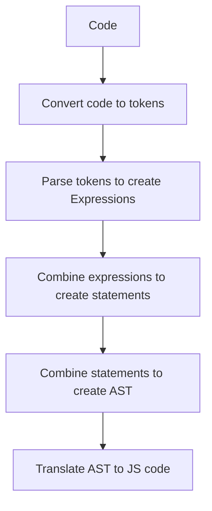

<p align="center">
  <a href="https://rudderstack.com/">
    
  </a>
</p>

<p align="center"><b>The Customer Data Platform for Developers</b></p>

<p align="center">
  <b>
    <a href="https://rudderstack.com">Website</a>
    ·
    <a href="https://github.com/rudderlabs/rudder-json-template-engine/blob/main/docs/syntax.md">Documentation</a>
    ·
    <a href="https://rudderstack.com/join-rudderstack-slack-community">Community Slack</a>
  </b>
</p>

---

# JSON Template Engine
## Overview

Welcome to our JSON Template Engine! This powerful tool simplifies transforming JSON data from one format to another, making it easier to manage and maintain complex integrations. 

### Why JSON Template Engine?

As an integration platform supporting over 200 integrations, we understand the challenges of maintaining and optimizing these connections. Traditionally, we used native JavaScript code for data transformation, which required significant effort and maintenance. While JSONata offered a more efficient way to manipulate JSON data, we still encountered performance bottlenecks due to its parsing and interpretation overhead.

### Our Solution

To address these challenges, we've developed our own JSON Transformation Engine. This engine generates optimized JavaScript code from transformation templates, reducing runtime overhead and significantly improving performance.

## Key Features

- **Efficiency**: Our engine generates JavaScript code that minimizes parsing and interpretation overhead, ensuring faster execution.

- **Extensibility**: Easily add new transformation templates to meet your specific integration needs.

- **Simplicity**: Write concise transformation templates that are easy to understand and maintain.
  
## Implementation
This library generates a javascript function code from the template and then uses the function to evaluate the JSON data. It outputs the javascript code in the following stages:
1. [Lexing](src/lexer.ts) (Tokenization)
1. [Parsing](src/parser.ts) (AST Creation)
1. [Translation](src/translator.ts) (Code generation)



[Engine](src/engine.ts) class abstracts the above steps and provides a convenient way to use the json templates to evaluate the inputs.

## Features
1. [Variables](test/scenarios/assignments/template.jt)
1. [Arrays](test/scenarios//arrays/template.jt)
1. [Objects](test/scenarios/objects/template.jt)
1. [Functions](test/scenarios/functions/template.jt)
1. [Bindings](test/scenarios/bindings/template.jt)
1. [Comments](test/scenarios/comments/template.jt)
1. [Paths](test/scenarios/paths/template.jt)
    * [Filters](test/scenarios/filters)
    * [Selectors](test/scenarios/selectors)
    * [Context variables](test/scenarios/context_variables/template.jt)
    * [Simple paths](test/scenarios/paths/simple_path.jt)
    * [Rich paths](test/scenarios/paths/rich_path.jt)
    * [Paths options](test/scenarios/paths/options.jt)
1. [Conditions](test/scenarios/conditions/template.jt)
    * [Comparisons](test/scenarios/comparisons/template.jt)
1. [Math operations](test/scenarios/math/template.jt)
1. [Logical operations](test/scenarios/logics/template.jt)
1. [Compile time expressions](test/scenarios/compile_time_expressions/template.jt)

For more examples, refer [Scenarios](test/scenarios)

## [Syntax](docs/syntax.md)

## Getting started
`npm install rudder-json-template-engine`

```ts
const { JsonTemplateEngine } = require('rudder-json-template-engine');
const engine = JsonTemplateEngine.create(`'Hello ' + .name`);
engine.evaluate({name: 'World'}); // => 'Hello World'
```

## Testing
`npm test`

## Contribute

We would love to see you contribute to RudderStack. Get more information on how to contribute [**here**](CONTRIBUTING.md).

## License

The RudderStack `rudder-json-template-engine` is released under the [**MIT License**](https://opensource.org/licenses/MIT).
